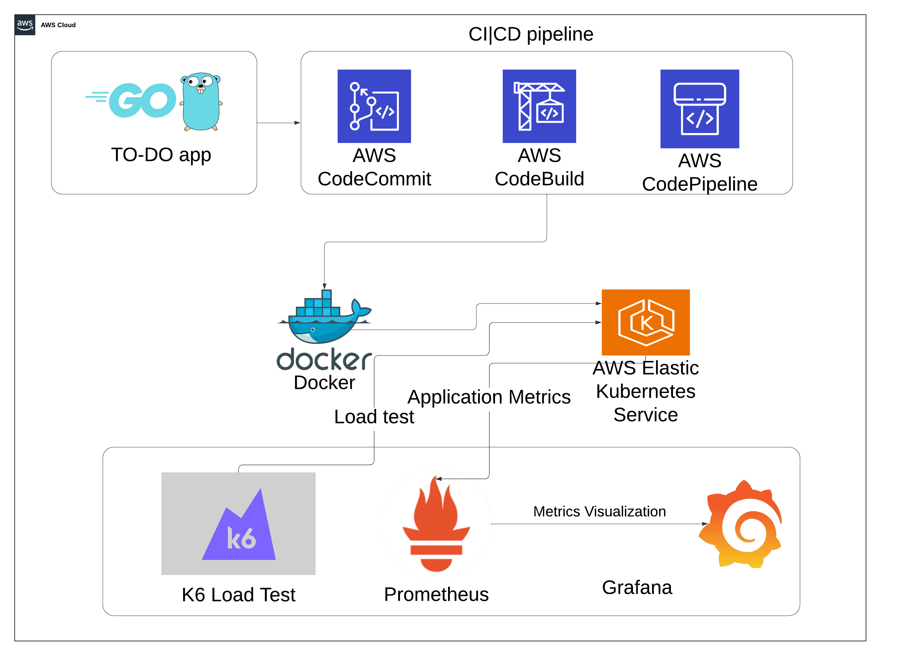

# Go & Kubernates Project on AWS EKS with CI/CD and Monitoring



This repository is for deploying a **Golang CRUD application** with **PostgreSQL RDS** on **Amazon EKS**. It includes a CI/CD pipeline with AWS CodeCommit, CodeBuild, and CodePipeline, and monitoring with Prometheus and Grafana. Load testing was performed using k6.

## Running Locally

### Initialize Base Image
```bash
bsf init
```

### Build OCI Artifact with ECR
```bash
aws ecr create-repository --repository-name devops-project
ECR_REPOSITORY_URI=$(aws ecr describe-repositories --repository-names devops-project --query "repositories[0].repositoryUri" --output text)

$(aws ecr get-login --no-include-email --region us-east-1)

docker build -t $ECR_REPOSITORY_URI:prod-v1 .
docker push $ECR_REPOSITORY_URI:prod-v1
```

### Running Using Docker
```bash
docker run -d --name grafana -p 3000:3000 grafana/grafana
docker run -d --name prometheus -p 9090:9090 -v $(pwd)/prometheus.yml:/etc/prometheus/prometheus.yml prom/prometheus
docker run --name local-postgres -e POSTGRES_USER=myuser -e POSTGRES_PASSWORD=mypassword -e POSTGRES_DB=mydb -p 5432:5432 -d postgres

docker exec -it local-postgres psql -U myuser -d mydb
CREATE TABLE goals (
    id SERIAL PRIMARY KEY,
    goal_name TEXT NOT NULL
);

docker run -d \
  -p 8080:8080 \
  -e DB_USERNAME=myuser \
  -e DB_PASSWORD=mypassword \
  -e DB_HOST=host.docker.internal \
  -e DB_PORT=5432 \
  -e DB_NAME=mydb \
  -e SSL=disable \
  $ECR_REPOSITORY_URI:prod-v1
```

---

## Cluster Creation on AWS EKS
### Create the EKS Cluster
```bash
eksctl create cluster --name devops-project --version 1.29 --region us-east-1
```

### Configure Kubeconfig
```bash
aws eks update-kubeconfig --region us-east-1 --name devops-project
```

---

## Deploying Components

### Install Monitoring Stack (Prometheus and Grafana)
```bash
helm repo add prometheus-community https://prometheus-community.github.io/helm-charts
helm repo update
helm install kube-prometheus-stack prometheus-community/kube-prometheus-stack --namespace monitoring --create-namespace
```

#### Access Grafana
Retrieve the admin password:
```bash
kubectl get secret --namespace monitoring kube-prometheus-stack-grafana -o jsonpath="{.data.admin-password}" | base64 --decode ; echo
```

Port-forward Grafana to access it locally:
```bash
kubectl port-forward svc/grafana 3000:80 -n monitoring
```

### Deploy PostgreSQL Database on AWS RDS
Provision a PostgreSQL RDS instance via the AWS Management Console or AWS CLI and ensure the database is publicly accessible. Update the application with the RDS endpoint.

### Create Kubernetes Secrets for Database Credentials
```bash
kubectl create secret generic rds-credentials \                                      
  --from-literal=DB_HOST=database-1.cx4uii88iaxq.us-east-1.rds.amazonaws.com \
  --from-literal=DB_PORT=5432 \
  --from-literal=DB_USER=myuser \
  --from-literal=DB_PASSWORD=mypassword\
  --from-literal=DB_NAME=mydb
```

### Deploy the Application
Update the Kubernetes deployment file with your Docker image and database secrets. Then deploy the application:
```bash
kubectl apply -f deploy/deploy.yaml
```

---

## CI/CD Pipeline Setup

### AWS CodePipeline Workflow:
1. **CodeCommit**: Repository for managing the source code.
2. **CodeBuild**: Builds the Docker image for the application.
3. **CodePipeline**: Orchestrates the workflow from CodeCommit to EKS deployment.

### Steps:
- Create a **CodeCommit** repository and push your code.
- Configure **CodeBuild** to build and push Docker images to Amazon ECR.
- Set up **CodePipeline** to deploy the updated Docker image to EKS using `kubectl`.

You can follow this [tutorial](https://devopslearning.medium.com/ci-cd-pipeline-for-eks-using-codecommit-codebuild-codepipeline-and-elastic-container-100f4b85e434) for a step-by-step guide to setting up the CI/CD pipeline.

---

## Load Testing with k6
### Run Load Test
```bash
k6 run load.js
```

---

## Monitoring
### Prometheus and Grafana
Prometheus scrapes metrics, and Grafana visualizes them. Use the dashboards to monitor:
- CPU/Memory usage
- Request latencies
- Database performance

---
